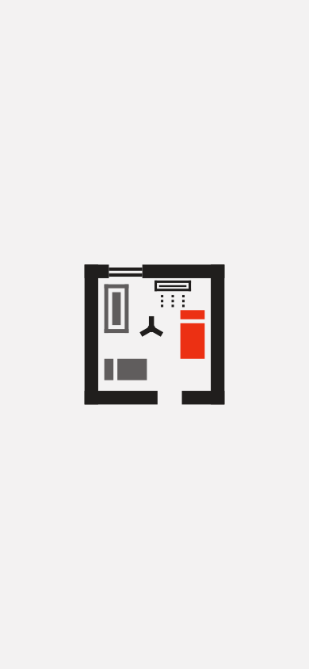
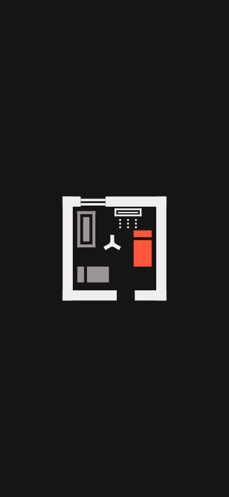

# App assets for Build: notification icon + splash (Brand chat, 2026-10-03)

Logo stays **B3-a2** (`logo.md`). This file is the spec; the files are in `docs/brand/assets/`.
Rebuild them with `python3 docs/brand/tools/make_app_assets.py` (needs `pip install cairosvg`).
Build: do this on a branch (`feature/brand-app-assets`), then merge per standing approval.

## 1. Notification icon `ic_stat_hostelzy`

### Why it changes
- Server (FCM) pushes don't name an icon today (`supabase/functions/_shared/fcm.ts` sends no
  `android.notification.icon`, the manifest has no `default_notification_icon`), so Android shows a
  **grey/white square** for them. Local reminders (F20) already use `ic_stat_hostelzy`.
- The old `ic_stat_hostelzy` (the room with window, AC bar, fan dot) was a mush at 24 px. **New
  drawing**, made for the status bar:
  walls with a door gap, other beds as **outlines**, **your bed filled**. In one colour, "filled"
  does the job red does in the full logo.


### Spec
| | |
|---|---|
| Grid | 24 × 24 dp, 2 dp padding (drawing inside 20 × 20 dp) |
| Colour | White `#FFFFFF` only, on transparent. Android tints it; never ship it in colour |
| Accent colour | `#EC3013` (Pal light `ac`): Android uses it for the small icon/app name in the shade |
| Walls | 2 dp; door gap 4 dp at the bottom. Outlines 1 dp. Your bed 4 × 9 dp, solid |

### Files (`docs/brand/assets/notification/`)
| File | Size | Goes to |
|---|---|---|
| `ic_stat_hostelzy.xml` (**use this**) | vector, 24 dp | `res/drawable/ic_stat_hostelzy.xml` |
| `ic_stat_hostelzy-mdpi.png` | 24 × 24 | only if you keep PNGs: `res/drawable-mdpi/ic_stat_hostelzy.png` |
| `ic_stat_hostelzy-hdpi.png` | 36 × 36 | `res/drawable-hdpi/…` |
| `ic_stat_hostelzy-xhdpi.png` | 48 × 48 | `res/drawable-xhdpi/…` |
| `ic_stat_hostelzy-xxhdpi.png` | 72 × 72 | `res/drawable-xxhdpi/…` |
| `ic_stat_hostelzy-xxxhdpi.png` | 96 × 96 | `res/drawable-xxxhdpi/…` |
| `ic_stat_hostelzy.svg` | 24 × 24 | source |

### Build steps
1. **Delete** the 5 old `res/drawable-*dpi/ic_stat_hostelzy.png` and add
   `res/drawable/ic_stat_hostelzy.xml` (one sharp file for every density). Don't keep both: a
   density PNG would win over the vector. `res/raw/keep.xml` already keeps the name.
2. `res/values/colors.xml` (new file, or add to an existing one):
   ```xml
   <color name="hz_notification">#EC3013</color>
   ```
3. `AndroidManifest.xml`, inside `<application>` (covers pushes that arrive while the app is closed,
   which Android draws itself):
   ```xml
   <meta-data android:name="com.google.firebase.messaging.default_notification_icon"
              android:resource="@drawable/ic_stat_hostelzy"/>
   <meta-data android:name="com.google.firebase.messaging.default_notification_color"
              android:resource="@color/hz_notification"/>
   ```
4. Server, `supabase/functions/_shared/fcm.ts` (`fcmMessage`): add the same to the Android block so
   it never depends on the manifest:
   `android: { priority: 'high', notification: { icon: 'ic_stat_hostelzy', color: '#EC3013' } }`
   (update `supabase/functions/tests/fcm.test.ts`).
5. F20 reminders (`lib/reminders.dart`): keep `icon: 'ic_stat_hostelzy'`; add
   `color: Color(0xFFEC3013)` to `_channel`.
6. Check on a phone: lock screen, shade (light and dark), and a push with the app killed.

## 2. Splash screen (Android 12+ and older)

### Why it changes
Today `launch_background.xml` is `@android:color/white` in light **and** dark, and Android 12+
uses its own default (white or black + the launcher icon). The app's ground is `#F3F2F2` (light) /
`#161514` (dark) (`Pal.bg`), so the phone flashes white before the first screen.

### What it looks like
The room (B3-a2, full detail) centred on the app ground. No text, no animation (the "bed mila!"
animation stays a later idea).

| Light | Dark |
|---|---|
|  |  |

### Spec
| | |
|---|---|
| Background | light `#F3F2F2`, dark `#161514` (exactly `Pal.light.bg` / `Pal.dark.bg`) |
| Icon canvas | 288 × 288 dp, transparent (Android 12 "icon without background") |
| Room inside | 128 × 128 dp, centred: corners stay inside the 192 dp circle Android keeps |
| Room colours | light: walls `#201E1D`, beds `#605D5D`, your bed `#EC3013`; dark: `#F0EEEE`, `#9A9696`, `#FF563C` |

### Files (`docs/brand/assets/splash/`)
| File | Size (px) | Goes to |
|---|---|---|
| `splash_icon-light-mdpi.png` | 288 | `res/drawable-mdpi/splash_icon.png` |
| `splash_icon-light-hdpi.png` | 432 | `res/drawable-hdpi/splash_icon.png` |
| `splash_icon-light-xhdpi.png` | 576 | `res/drawable-xhdpi/splash_icon.png` |
| `splash_icon-light-xxhdpi.png` | 864 | `res/drawable-xxhdpi/splash_icon.png` |
| `splash_icon-light-xxxhdpi.png` | 1152 | `res/drawable-xxxhdpi/splash_icon.png` |
| `splash_icon-dark-{mdpi…xxxhdpi}.png` | same | `res/drawable-night-{mdpi…xxxhdpi}/splash_icon.png` |
| `preview-light.png`, `preview-dark.png` | 390 × 844 | review only, don't ship |

No new package needed (no `flutter_native_splash`): plain Android resources.

### Build steps
1. Colours:
   - `res/values/colors.xml`: `<color name="splash_bg">#F3F2F2</color>`
   - `res/values-night/colors.xml`: `<color name="splash_bg">#161514</color>`
2. Older Android: replace **both** `res/drawable/launch_background.xml` and
   `res/drawable-v21/launch_background.xml` with:
   ```xml
   <layer-list xmlns:android="http://schemas.android.com/apk/res/android">
       <item android:drawable="@color/splash_bg"/>
       <item><bitmap android:gravity="center" android:src="@drawable/splash_icon"/></item>
   </layer-list>
   ```
   (Light/dark come from the `-night` colour and drawable folders.)
3. Android 12+: add `res/values-v31/styles.xml` **and** `res/values-night-v31/styles.xml`
   (the night one is needed: `values-night` beats `values-v31`, so without it dark phones on 12+
   would miss the splash settings):
   ```xml
   <resources>
       <style name="LaunchTheme" parent="@android:style/Theme.Light.NoTitleBar">  <!-- night: Theme.Black.NoTitleBar -->
           <item name="android:windowBackground">@drawable/launch_background</item>
           <item name="android:windowSplashScreenBackground">@color/splash_bg</item>
           <item name="android:windowSplashScreenAnimatedIcon">@drawable/splash_icon</item>
       </style>
       <style name="NormalTheme" parent="@android:style/Theme.Light.NoTitleBar">  <!-- night: Theme.Black.NoTitleBar -->
           <item name="android:windowBackground">@color/splash_bg</item>
       </style>
   </resources>
   ```
4. In `values/styles.xml` and `values-night/styles.xml` set `NormalTheme`'s `windowBackground` to
   `@color/splash_bg` too, so there is no white flash between the splash and the first frame.
5. Check on Android 12+ and an older phone (or emulator), light and dark: ground matches the first
   screen, room centred, not cut.

## Screens added / removed
None (system assets only). Design: no new board needed.
